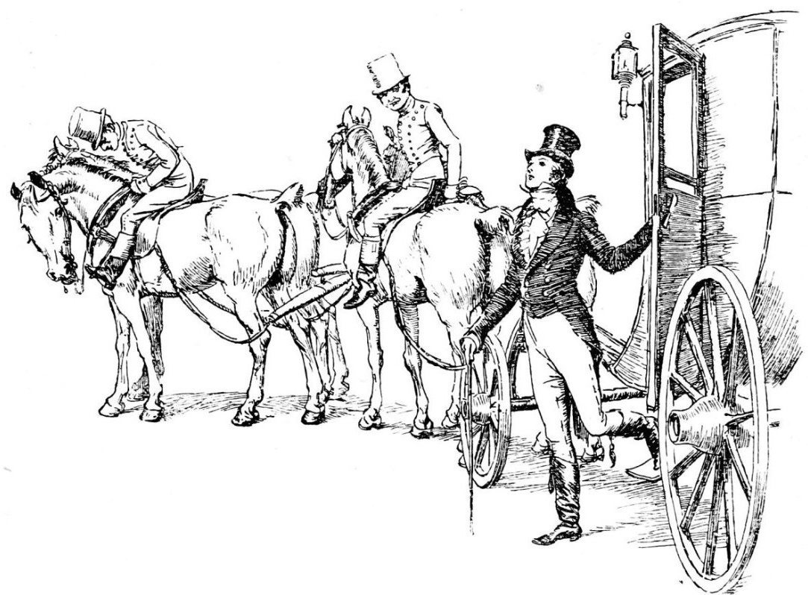

## Chapter I.

T is a truth universally acknowledged, that a single man in possession of aa good fortune must be in want of a wife.

However little known the feelings or views of such a man may be on his firsfirst entering a neighbourhood, this truth is so well fixed in the minds ofof the surrounding families, that he is considered as the rightful propertyproperty of some one or other of their daughters.

"My dear Mr. Bennet," said his lady to him one day, "have you heard that NeNetherfield Park is let at last?"

Mr. Bennet replied that he had not.

"But it is," returned she; "for Mrs. Long has just been here, and she toldme all about it."

Mr. Bennet made no answer.

"Do not you want to know who has taken it?" cried his wife, impatiently.

"You want to tell me, and I have no objection to hearing it."

"He came down to see the place" [Copyright 1894 by George Allen.]

This was invitation enough.

"Why, my dear, you must know, Mrs. Long says that Netherfield is taken by aa young man of large fortune from the north of England; that he came down oon Monday in a chaise and four to see the place, and was so
